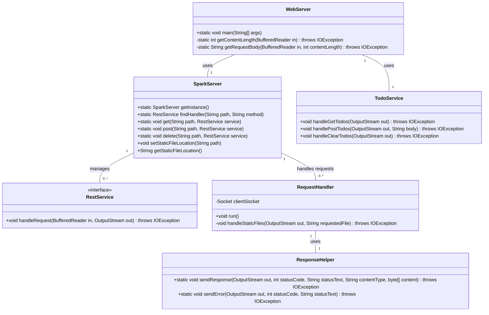
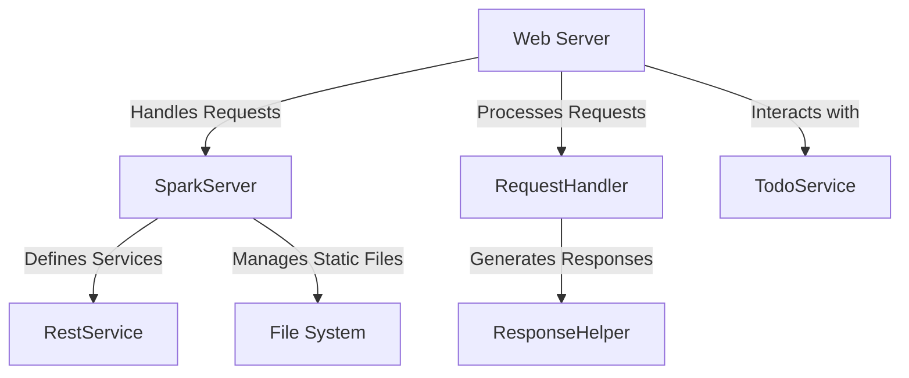

# Web Framework Development for REST Services and Static File Management

## Descripción del Proyecto

Este proyecto amplía un servidor web existente, que actualmente soporta archivos HTML, JavaScript, CSS e imágenes, transformándolo en un marco web completamente funcional. Este marco permite el desarrollo de aplicaciones web con servicios REST backend. Proporciona herramientas para definir servicios REST utilizando funciones lambda, gestionar valores de consulta dentro de las solicitudes y especificar la ubicación de archivos estáticos.

## Requisitos

-   **Java Development Kit (JDK) 8 o superior**
-   **Maven 3.6.0 o superior**
-   **Un IDE como IntelliJ IDEA, Eclipse, o simplemente un editor de texto como Visual Studio Code**
-   **Un navegador web**

## Cómo Ejecutar el Proyecto

**1. Clona el Repositorio:**

        git clone https://github.com/tu_usuario/tu_repositorio.git 

**2. Construye el Proyecto:** Asegúrate de tener Maven instalado. Luego, ejecuta:

        mvn exec:java

**3. Accede a la Aplicación:** Abre un navegador y visita http://localhost:8080.

## Arquitectura

### Diagrama de Clases

### Diagrama de Componentes

## Pruebas

**1. Probar el proyecto:** Ejecuta el siguiente comando:

    mvn test

  
  
   
  
**2. Pruebas de funcionamiento:** A continuación se puede observar el programa funcionando correctamente:

## Contacto

Autor: Sebastián David Blanco Rodríguez

## Licencia

Este proyecto está licenciado bajo la Licencia MIT. Consulta el archivo `LICENSE` para más detalles.
